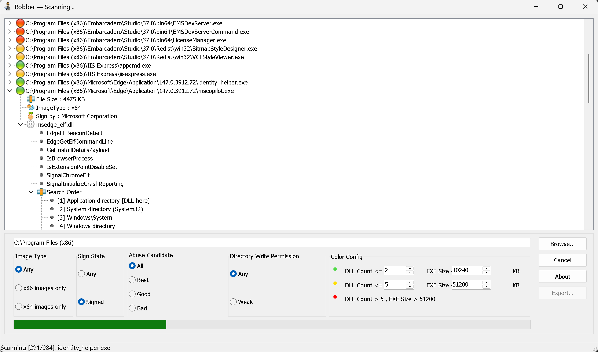

# Robber — DLL Hijack Scanner

Robber scans a directory tree for Windows executables vulnerable to DLL hijacking. It inspects each PE's import table, checks which referenced DLLs are present in the executable's own directory, and rates the attack surface by severity.

No third-party dependencies. Runs as a GUI or headless CLI.

---

## What is DLL hijacking?

When Windows loads a DLL by name (not absolute path), it searches a fixed set of directories in order:

1. Directory of the executable
2. `System32`
3. `Windows\System`
4. `Windows`
5. Directories in `%PATH%`

If an attacker can plant a malicious DLL in a directory that appears **earlier** in this list than the real DLL, Windows loads the attacker's version instead. Robber finds executables where this is possible.

---

## GUI



### Running a scan

1. Click **Browse...** and select a directory (e.g. `C:\Program Files`)
2. Set your filters (optional)
3. Click **Scan** — progress shows in the status bar; click again to cancel
4. Results appear in the tree — expand any executable to see vulnerable DLLs, exported methods, and the full DLL search order for each

### Filters

| Filter | Options | Effect |
|--------|---------|--------|
| Image Type | Any / x86 only / x64 only | Architecture of the executable |
| Sign State | Any / Signed only | Code-signing status |
| Abuse Candidate | All / Best / Good / Bad | Minimum severity rating |
| Directory Write Permission | Any / Weak only | Only show executables in writable directories |

### Severity ratings

Ratings are based on how many hijackable DLLs the executable imports and its file size. Thresholds are configurable in the **Color Config** panel.

| Color | Rating | Meaning |
|-------|--------|---------|
| Green | **Best** | Few DLLs, small binary — easy to proxy, high chance of stable execution |
| Yellow | **Good** | Moderate number of DLLs or larger binary |
| Red | **Bad** | Many DLLs or large binary — harder to proxy reliably |

### Exporting results

After a scan completes, click **Export...** to save:
- **JSON** — nested structure: executable → DLLs → methods + search order
- **CSV** — flat, one row per method; suitable for spreadsheets and grep

Settings (last path, filters, thresholds) are saved automatically and restored on next launch.

---

## CLI

Robber runs headlessly when invoked with `--path`. Attach it to an existing console — no new window opens.

```
Robber.exe --path <dir> [options]
```

### Options

```
--path <dir>               Directory to scan (required)
--output <file>            Output file (.json or .csv). Default: stdout JSON
--image-type any|x86|x64  Filter by architecture (default: any)
--sign any|signed          Filter by signing status (default: any)
--rate any|best|good|bad   Filter by severity rating (default: any)
--write-perm               Only include executables in writable directories
--best-dll-count <n>       Best rating: max DLL count (default: 2)
--best-exe-size <n>        Best rating: max size in KB (default: 10240)
--good-dll-count <n>       Good rating: max DLL count (default: 5)
--good-exe-size <n>        Good rating: max size in KB (default: 51200)
--help                     Show this help
```

### Examples

```bash
# Scan Program Files, save results as JSON
Robber.exe --path "C:\Program Files" --output results.json

# Only Best-rated targets in writable directories, CSV output
Robber.exe --path "C:\Program Files" --rate best --write-perm --output hits.csv

# Pipe JSON to jq
Robber.exe --path "C:\Program Files" | jq '.[].exePath'

# Signed executables only, x64
Robber.exe --path "C:\Tools" --sign signed --image-type x64
```

Progress is written to **stderr**; results go to **stdout** — safe to pipe or redirect independently.

---

## Understanding results

Each result shows:

- **File size** and **architecture** (x86 / x64)
- **Signer** — company name from the code-signing certificate, if present
- **UAC level** — `requireAdministrator` or `highestAvailable` flagged as a warning (elevated process = higher impact)
- **Vulnerable DLLs** — each one lists:
  - Imported method names (the functions your proxy DLL must export)
  - **Search Order** — the exact directories Windows would check, with `[DLL here]` and `[WRITABLE]` flags

System DLLs (`System32`, `SysWOW64`, `Windows\System`) are automatically excluded to eliminate false positives from redistributable runtimes.

---

## Building from source

Requires **Delphi XE2** or later. Open `Robber\Robber.dproj` and build. No external packages or libraries needed.

---

## License

MIT — see [LICENSE](LICENSE)
